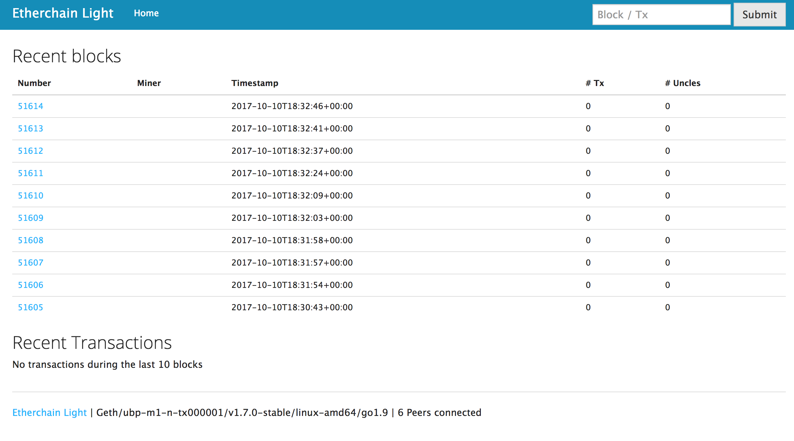

# Etherchain Light

> Lightweight block explorer for private Ethereum chain

Etherchain Light is an Ethereum blockchain explorer built with NodeJS, Express and Parity. It does not require an external database and retrieves all information from a backend Ethereum node.

## Getting Started

4. `git clone https://github.com/jpoon/etherchain-light`
5. `cd etherchain-light` and `npm install`
6. Rename `config.js.example` into `config.js` and adjust the file to your local environment
7. Start the explorer: `npm start`
8. Browse to `http://localhost:3000`

## Notes

This blockchain explorer is intended for private Ethereum chains. As it does not have a dedicated database all data will be retrived on demand from a backend Parity node. Some of those calls are resource intensive (e.g. retrieval of the full tx list of an account) and do not scale well for accounts with a huge number of transactions.
